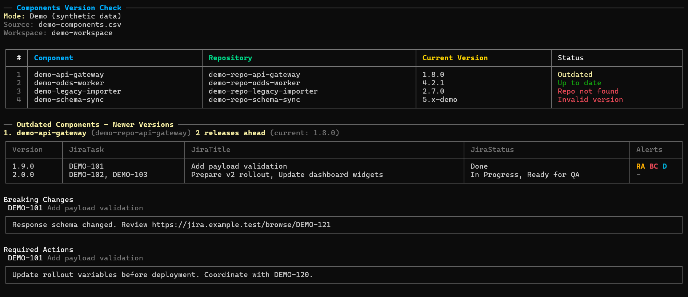
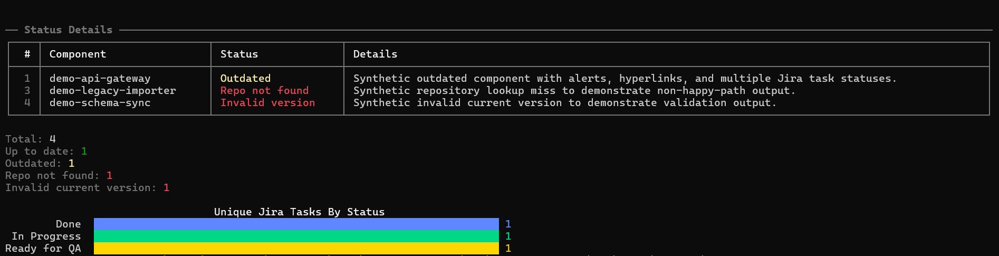
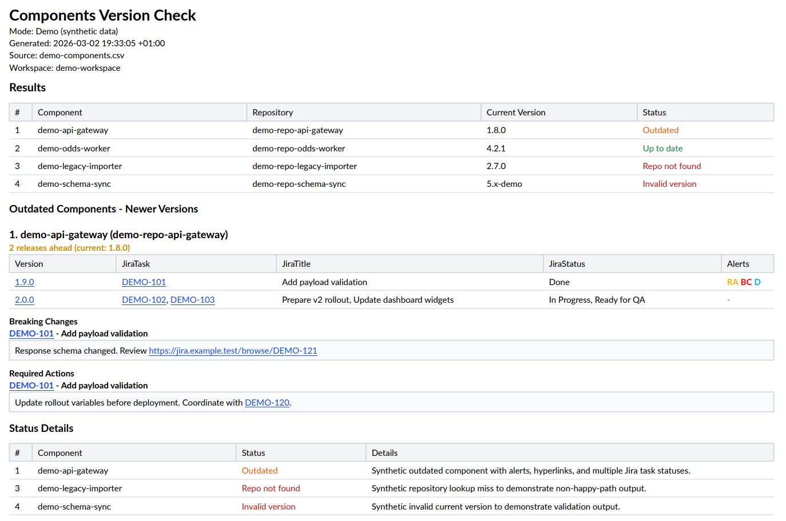
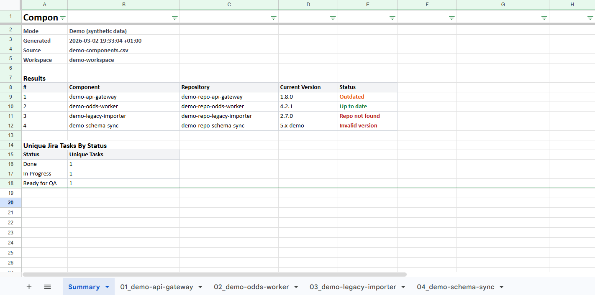

# NReleaseBuilder

NReleaseBuilder is a .NET console application that checks deployed component versions from a CSV file against Bitbucket tags, then enriches newer versions with Jira task and status information.

## Project Structure

```text
NReleaseBuilder/
|-- Abstractions/
|-- Application/
|-- Bitbucket/
|-- Configuration/
|-- Csv/
|-- Jira/
|-- Models/
|-- Presentation/
|   |-- Console/
|   |-- Excel/
|   `-- Pdf/
|-- Transport/
|-- Program.cs
`-- appsettings.json
```

### Layers and Responsibilities

| Layer | Main folders | Responsibility |
| --- | --- | --- |
| Composition root | `Program.cs` | Registers DI services, configures HTTP clients and application startup. |
| Abstractions | `Abstractions/` | Defines interfaces used between layers (rendering, integrations, application workflow). |
| Application | `Application/` | Orchestrates the end-to-end version check use case via abstractions. |
| Domain model | `Models/` | Value objects and domain models used across the app. |
| Infrastructure / integrations | `Bitbucket/`, `Jira/`, `Csv/`, `Transport/` | External API access, parsing, retry/serialization, and CSV input handling. |
| Presentation | `Presentation/Console/`, `Presentation/Excel/`, `Presentation/Pdf/`, `Presentation/GeneralFacadeRenderer.cs` | Console, Excel, and PDF output composition and rendering orchestration. |
| Configuration | `Configuration/`, `appsettings.json` | Typed settings, validation rules, and runtime options. |

## What It Does

1. Reads a CSV file (expects `container` and `image` columns).
2. Extracts repository and current version from each image tag.
3. Loads tags from Bitbucket for each repository.
4. Detects versions newer than the current one.
5. Extracts Jira task keys from related commit messages.
6. Resolves Jira statuses for those tasks.
7. Generates reports:
   - console report with:
     - per-component status table
     - summary counters
     - unique Jira tasks by status chart
   - Excel report (when `Excel.Enabled` is `true`) with:
     - `Summary` sheet for `Results` and `Unique Jira Tasks By Status`
     - one sheet per component
     - `Breaking Changes` and `Required Actions` sections
     - hyperlinks and status/alert colors aligned with the PDF output
   - PDF report (when `Pdf.Enabled` is `true`) with filtered results and details

## Recommended Development Flow

This utility is useful for projects using:

- trunk-based development
- continuous versioning
- sequential releases
- feature -> `master` merge flow

Typical fit:

- each feature is developed in a separate branch and merged directly into `master`
- `master` is the single source of truth
- each merge to `master` produces a new versioned artifact
- service versions grow sequentially during active development (for example: `1.0.0`, `1.0.1`, `1.0.2`, ... `2.0.0`)

## Configuration

Edit `src/NReleaseBuilder/appsettings.json`.

Recommended example:

```json
{
  "CsvFilePath": "C:\\path\\to\\components.csv",
  "CsvComponentNamesFilter": [],
  "CsvComponentGroups": [
    {
      "Name": "Backoffice",
      "ComponentNames": [ "api-a", "api-b" ],
      "PdfOutputPath": "backoffice-report.pdf",
      "ExcelOutputPath": "backoffice-report.xlsx"
    },
    {
      "Name": "Export",
      "ComponentNames": [ "svc-x", "svc-y" ],
      "PdfOutputPath": "export-report.pdf",
      "ExcelOutputPath": "export-report.xlsx"
    }
  ],
  "Pdf": {
    "Enabled": true,
    "OutputPath": "nreleasebuilder-report.pdf"
  },
  "Excel": {
    "Enabled": true,
    "OutputPath": "nreleasebuilder-report.xlsx"
  },
  "Bitbucket": {
    "BaseUrl": "https://api.bitbucket.org/2.0",
    "Workspace": "your-workspace",
    "ProjectNames": [ "AAA", "BBB" ],
    "AuthEmail": "you@example.com",
    "AuthApiToken": "your-bitbucket-token",
    "PageLen": 50,
    "RetryCount": 2,
    "MaxParallelRequests": 6,
    "RepositoryNameOverrides": {}
  },
  "Jira": {
    "BaseUrl": "https://your-company.atlassian.net",
    "Email": "you@example.com",
    "ApiToken": "your-jira-token",
    "AllowedTaskStatuses": [],
    "CheckReleaseAlerts": false,
    "RequiredActionsFieldName": "Required Actions",
    "BreakingChangesFieldName": "Breaking changes",
    "RetryCount": 2,
    "MaxParallelRequests": 2
  }
}
```

### Root Options

| Key | Required | Default | Notes |
| --- | --- | --- | --- |
| `CsvFilePath` | Yes | - | Path to source CSV file. File must exist. |
| `CsvComponentNamesFilter` | No | `[]` | Optional allow-list of component names (case-insensitive). |
| `CsvComponentGroups` | No | `[]` | Optional grouped filters. When non-empty, one report run is generated per group. |
| `Bitbucket` | Yes | - | Bitbucket API settings. |
| `Jira` | Yes | - | Jira API settings. |
| `Pdf` | No | `{ "Enabled": true, "OutputPath": "nreleasebuilder-report.pdf" }` | PDF report settings. |
| `Excel` | No | `{ "Enabled": false, "OutputPath": "nreleasebuilder-report.xlsx" }` | Excel report settings. |

### `CsvComponentGroups` Options

| Key | Required | Default | Notes |
| --- | --- | --- | --- |
| `Name` | Yes | `""` | Group display name shown in runtime logs and PDF header. Must be unique. |
| `ComponentNames` | Yes | `[]` | Group-specific component allow-list. Must contain at least one non-empty value. |
| `PdfOutputPath` | Required when `Pdf.Enabled=true` | `null` | Output path for this group's PDF report. Date suffix is appended automatically. |
| `ExcelOutputPath` | Required when `Excel.Enabled=true` | `null` | Output path for this group's Excel report. Date suffix is appended automatically. |

### `Bitbucket` Options

| Key | Required | Default | Notes |
| --- | --- | --- | --- |
| `BaseUrl` | Yes | - | Absolute Bitbucket API URL. |
| `Workspace` | Yes | - | Workspace identifier. |
| `ProjectNames` | Conditionally | `[]` | Jira project keys used for task extraction (for example `AAA`). |
| `ProjectName` | No | `""` | Backward-compatible alias for a single project key. |
| `AuthEmail` | Yes | - | Bitbucket auth email. |
| `AuthApiToken` | Yes | - | Bitbucket app password/token. |
| `PageLen` | No | `50` | Tags page size. Allowed range: `1..100`. |
| `RetryCount` | No | `2` | Retry attempts for transient HTTP errors. Allowed range: `0..10`. |
| `MaxParallelRequests` | No | `6` | Parallel request limit. Allowed range: `1..20`. |
| `RepositoryNameOverrides` | No | `{}` | Maps CSV repo names to actual Bitbucket repo names. |

Bitbucket repository name matching notes:

- By default, repository name comes from the image name parsed from CSV.
- In some environments, image name and Bitbucket repository name are not equal.
- Use `RepositoryNameOverrides` to map image/CSV repository names to actual Bitbucket repositories.

`Bitbucket` validation rules:

- At least one Jira project key must be provided via `ProjectNames` or `ProjectName`.
- `ProjectNames` must not contain empty values.
- `RepositoryNameOverrides` keys and values must be valid repository names.

### `Jira` Options

| Key | Required | Default | Notes |
| --- | --- | --- | --- |
| `BaseUrl` | Yes | - | Absolute Jira URL. |
| `Email` | Preferred | `""` | Jira auth email. |
| `ApiToken` | Preferred | `""` | Jira API token. |
| `AuthEmail` | No | `""` | Backward-compatible alias for `Email`. |
| `AuthApiToken` | No | `""` | Backward-compatible alias for `ApiToken`. |
| `AllowedTaskStatuses` | No | `[]` | If empty, no status filter is applied. |
| `CheckReleaseAlerts` | No | `false` | Enables parsing of required actions / breaking changes fields. |
| `RequiredActionsFieldName` | No | `"Required Actions"` | Jira custom field display name. |
| `BreakingChangesFieldName` | No | `"Breaking changes"` | Jira custom field display name. |
| `RetryCount` | No | `2` | Retry attempts for transient HTTP errors. Allowed range: `0..10`. |
| `MaxParallelRequests` | No | `2` | Parallel request limit. Allowed range: `1..20`. |

`Jira` validation rules:

- Credentials must be provided as a full pair (`Email` + `ApiToken`, or aliases).
- `AllowedTaskStatuses` must not contain empty values.
- `RequiredActionsFieldName` and `BreakingChangesFieldName` must not be empty.

### `Pdf` Options

| Key | Required | Default | Notes |
| --- | --- | --- | --- |
| `Enabled` | No | `true` | Enables PDF generation. |
| `OutputPath` | Required when `Enabled=true` | `nreleasebuilder-report.pdf` | Relative paths are resolved from current working directory. |

`Pdf` validation rules:

- `OutputPath` must be non-empty when PDF is enabled.
- `OutputPath` must be a valid file system path.

### `Excel` Options

| Key | Required | Default | Notes |
| --- | --- | --- | --- |
| `Enabled` | No | `false` | Enables Excel generation. |
| `OutputPath` | Required when `Enabled=true` | `nreleasebuilder-report.xlsx` | Relative paths are resolved from current working directory. |

`Excel` validation rules:

- `OutputPath` must be non-empty when Excel is enabled.
- `OutputPath` must be a valid file system path.

Excel report layout notes:

- `Summary` sheet contains the filtered `Results` table and `Unique Jira Tasks By Status`.
- Each component gets its own sheet.
- Component sheets include `Newer Versions`, `Breaking Changes`, and `Required Actions`.
- Hyperlinks are applied directly to version, Jira task, and details cells where available.
- Status and alert colors follow the same semantics as the PDF report.

General notes:

- `CsvComponentNamesFilter`: empty means all components are included.
- `CsvComponentGroups`: when configured, `CsvComponentNamesFilter` is ignored and per-group filters are used instead.
- `Jira.AllowedTaskStatuses`: non-empty means all detected statuses for a row must be in the allow-list.
- Do not commit real credentials to source control.

## Expected CSV Format

Example with fictional names:

```csv
container,image
demo-engine,registry.invalid/galaxy.orbit.engine:1.2.3
sample-worker,registry.invalid/moonlight.task.runner:2.4.0
```

Only `container` and `image` are required.

## Output

>For demonstration purposes, the program output shown in the screenshots uses synthetic data to avoid exposing information from real Jira issues and users.

### Console



### PDF


### Excel

