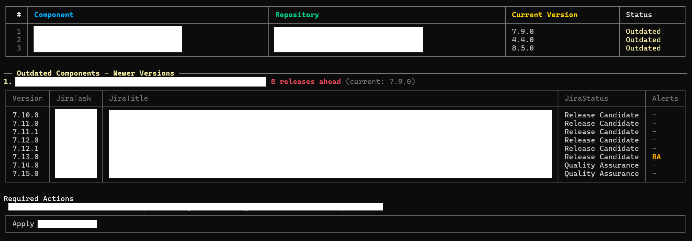

# NReleaseBuilder

NReleaseBuilder is a .NET console application that checks deployed component versions from a CSV file against Bitbucket tags, then enriches newer versions with Jira task and status information.

## What It Does

1. Reads a CSV file (expects `container` and `image` columns).
2. Extracts repository and current version from each image tag.
3. Loads tags from Bitbucket for each repository.
4. Detects versions newer than the current one.
5. Extracts Jira task keys from related commit messages.
6. Resolves Jira statuses for those tasks.
7. Generates reports:
   - console report with:
     - per-component status table
     - summary counters
     - unique Jira tasks by status chart
   - PDF report (when `Pdf.Enabled` is `true`) with filtered results and details

## Configuration

Edit `src/NReleaseBuilder/appsettings.json`.

Recommended example:

```json
{
  "CsvFilePath": "C:\\path\\to\\components.csv",
  "CsvComponentNamesFilter": [],
  "Pdf": {
    "Enabled": true,
    "OutputPath": "nreleasebuilder-report.pdf"
  },
  "Bitbucket": {
    "BaseUrl": "https://api.bitbucket.org/2.0",
    "Workspace": "your-workspace",
    "ProjectNames": [ "AAA", "BBB" ],
    "AuthEmail": "you@example.com",
    "AuthApiToken": "your-bitbucket-token",
    "PageLen": 50,
    "RetryCount": 2,
    "MaxParallelRequests": 6,
    "UseTruncatedRepositoryNameFallback": false,
    "RepositoryNameOverrides": {}
  },
  "Jira": {
    "BaseUrl": "https://your-company.atlassian.net",
    "Email": "you@example.com",
    "ApiToken": "your-jira-token",
    "AllowedTaskStatuses": [],
    "CheckReleaseAlerts": false,
    "RequiredActionsFieldName": "Required Actions",
    "BreakingChangesFieldName": "Breaking changes",
    "RetryCount": 2,
    "MaxParallelRequests": 2
  }
}
```

### Root Options

| Key | Required | Default | Notes |
| --- | --- | --- | --- |
| `CsvFilePath` | Yes | - | Path to source CSV file. File must exist. |
| `CsvComponentNamesFilter` | No | `[]` | Optional allow-list of component names (case-insensitive). |
| `Bitbucket` | Yes | - | Bitbucket API settings. |
| `Jira` | Yes | - | Jira API settings. |
| `Pdf` | No | `{ "Enabled": true, "OutputPath": "nreleasebuilder-report.pdf" }` | PDF report settings. |

### `Bitbucket` Options

| Key | Required | Default | Notes |
| --- | --- | --- | --- |
| `BaseUrl` | Yes | - | Absolute Bitbucket API URL. |
| `Workspace` | Yes | - | Workspace identifier. |
| `ProjectNames` | Conditionally | `[]` | Jira project keys used for task extraction (for example `AAA`). |
| `ProjectName` | No | `""` | Backward-compatible alias for a single project key. |
| `AuthEmail` | Yes | - | Bitbucket auth email. |
| `AuthApiToken` | Yes | - | Bitbucket app password/token. |
| `PageLen` | No | `50` | Tags page size. Allowed range: `1..100`. |
| `RetryCount` | No | `2` | Retry attempts for transient HTTP errors. Allowed range: `0..10`. |
| `MaxParallelRequests` | No | `6` | Parallel request limit. Allowed range: `1..20`. |
| `UseTruncatedRepositoryNameFallback` | No | `false` | Retry lookup with last dot-separated segment removed when repo is not found. |
| `RepositoryNameOverrides` | No | `{}` | Maps CSV repo names to actual Bitbucket repo names. |

Bitbucket repository name matching notes:

- By default, repository name comes from the image name parsed from CSV.
- In some environments, image name and Bitbucket repository name are not equal.
- Use `RepositoryNameOverrides` to map image/CSV repository names to actual Bitbucket repositories.
- Enable `UseTruncatedRepositoryNameFallback` to retry with a truncated name when lookup returns repository not found.

`Bitbucket` validation rules:

- At least one Jira project key must be provided via `ProjectNames` or `ProjectName`.
- `ProjectNames` must not contain empty values.
- `RepositoryNameOverrides` keys and values must be valid repository names.

### `Jira` Options

| Key | Required | Default | Notes |
| --- | --- | --- | --- |
| `BaseUrl` | Yes | - | Absolute Jira URL. |
| `Email` | Preferred | `""` | Jira auth email. |
| `ApiToken` | Preferred | `""` | Jira API token. |
| `AuthEmail` | No | `""` | Backward-compatible alias for `Email`. |
| `AuthApiToken` | No | `""` | Backward-compatible alias for `ApiToken`. |
| `AllowedTaskStatuses` | No | `[]` | If empty, no status filter is applied. |
| `CheckReleaseAlerts` | No | `false` | Enables parsing of required actions / breaking changes fields. |
| `RequiredActionsFieldName` | No | `"Required Actions"` | Jira custom field display name. |
| `BreakingChangesFieldName` | No | `"Breaking changes"` | Jira custom field display name. |
| `RetryCount` | No | `2` | Retry attempts for transient HTTP errors. Allowed range: `0..10`. |
| `MaxParallelRequests` | No | `2` | Parallel request limit. Allowed range: `1..20`. |

`Jira` validation rules:

- Credentials must be provided as a full pair (`Email` + `ApiToken`, or aliases).
- `AllowedTaskStatuses` must not contain empty values.
- `RequiredActionsFieldName` and `BreakingChangesFieldName` must not be empty.

### `Pdf` Options

| Key | Required | Default | Notes |
| --- | --- | --- | --- |
| `Enabled` | No | `true` | Enables PDF generation. |
| `OutputPath` | Required when `Enabled=true` | `nreleasebuilder-report.pdf` | Relative paths are resolved from current working directory. |

`Pdf` validation rules:

- `OutputPath` must be non-empty when PDF is enabled.
- `OutputPath` must be a valid file system path.

General notes:

- `CsvComponentNamesFilter`: empty means all components are included.
- `Jira.AllowedTaskStatuses`: non-empty means all detected statuses for a row must be in the allow-list.
- Do not commit real credentials to source control.

## Expected CSV Format

Example with fictional names:

```csv
container,image
demo-engine,registry.invalid/galaxy.orbit.engine:1.2.3
sample-worker,registry.invalid/moonlight.task.runner:2.4.0
```

Only `container` and `image` are required.

## 📄 Output
The utility console output.


